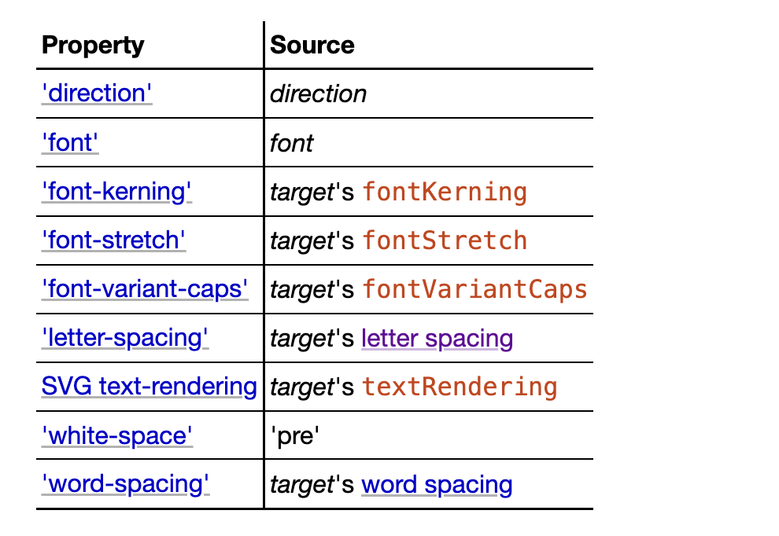
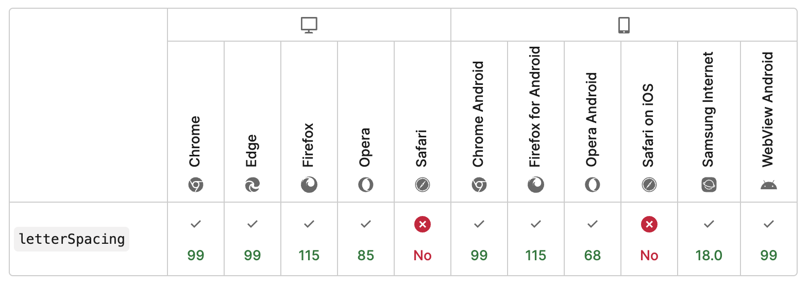
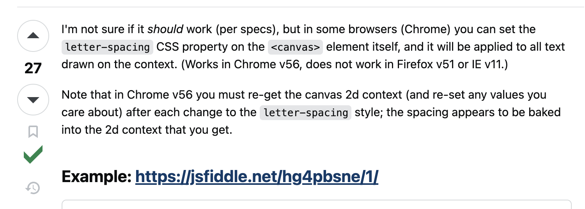

# measureText 与 letterSpacing
## measureText
不同于 DOM 方便的文字排版，在 Canvas 中想要实现文本换行、溢出隐藏/截断等功能，[`measureText`](https://developer.mozilla.org/zh-CN/docs/Web/API/CanvasRenderingContext2D/measureText) 是注定绕不开的 api

根据 HTML 标准描述：
>The measureText(text) method steps are to run the text preparation algorithm, passing it text and the object implementing the CanvasText interface, and then using the returned inline box must return a new TextMetrics object with members behaving as described in the following list:
https://html.spec.whatwg.org/multipage/canvas.html#dom-context-2d-measuretext

与 `fillText` 、 `strokeText` 类似，都会经历文本准备算法的排版，得到每个文字的矩形信息、物理对齐方式 (physical alignment) 与行内框 (inline box)
同时 `measureText` 会返回一个 [TextMetrics](https://developer.mozilla.org/zh-CN/docs/Web/API/TextMetrics) 对象
> The text preparation algorithm is as follows. It takes as input a string text, a CanvasTextDrawingStyles object target, and an optional length maxWidth. It returns an array of glyph shapes, each positioned on a common coordinate space, a physical alignment whose value is one of left, right, and center, and an inline box. (Most callers of this algorithm ignore the physical alignment and the inline box.)
https://html.spec.whatwg.org/multipage/canvas.html#text-preparation-algorithm

inline box 支持更改的 css 属性:


常规的用法如下:

```js
const ctx = canvas.getContext('2d');
ctx.font = '20px PingFang SC';
const metrics = ctx.measureText('Hello World');
console.log(metrics.width);
```
 `metrics.width` 作为一段文本的实际宽度将参与后续的换行、溢出等功能实现

但对于换行功能文章不会过多描述，网络上能搜到很多优秀的实现，相关原理也可以找到，这里贴一个张老师的博客链接 [canvas文本绘制自动换行、字间距、竖排等实现](https://www.zhangxinxu.com/wordpress/2018/02/canvas-text-break-line-letter-spacing-vertical/)

## letterSpacing
想着重介绍的是 [`letter-spacing`](https://developer.mozilla.org/en-US/docs/Web/CSS/letter-spacing)

这个属性在 CSS 中是设置文字间距的，但在 Canvas 中使用时，它的表现需要特别注意

当我们想在 `measureText` 时，设置文字间距应该怎么做？

```js
const ctx = canvas.getContext('2d');
ctx.letterSpacing = '10px';
const metrics = ctx.measureText('Hello World');
```
语法上没有问题，但是很遗憾， **Safari 不支持**

那能表示在 FireFox、Chrome 等浏览器中，`letterSpacing` 能符合预期的工作了吗？

不全是！！

**Chrome 实现了一个非标准的功能，`ctx.letterSpacing` 未显式定义时，会继承 `canvas.style.letterSpacing`**

相关参考链接：
> https://github.com/CreateJS/EaselJS/issues/872
  https://stackoverflow.com/questions/8952909/letter-spacing-in-canvas-element/8955835#8955835
  https://jsfiddle.net/hg4pbsne/1/

先来看一个例子:

```html
<style>canvas{letter-spacing: 0.1em}</style>
<canvas id="canvas"></canvas>
<script>
  const canvas = document.getElementById('canvas');
  const ctx = canvas.getContext('2d');
  ctx.font = '20px PingFang SC';
  console.log(ctx.letterSpacing); // 0px
  const metrics = ctx.measureText('一段文本');
  console.log(metrics.width); // 88px
</script>
```
这个场景下，Chrome 中 `ctx.letterSpacing` 打印是 0px，`canvas.style.letterSpacing` 是 `0.1em`，最终 `metrics.width` 测得 88px，**而 FireFox 中是 80px**，原因就如前文所说，这是 Chrome 独家秘方

**项目中遇到测量的宽度不符合预期时，记得检查一下 canvas 标签的样式**

如果在意两个浏览器的表现一致，可以简单处理:

```js
ctx.letterSpacing = getComputedStyle(canvas).letterSpacing;
```

如果想完全屏蔽样式的影响，也可以使用 [OffscreenCanvas](https://developer.mozilla.org/zh-CN/docs/Web/API/OffscreenCanvas) 来进行文本测量，它的兼容性已经非常不错了

只是浏览器之间有差异，还能接受，事实上 Chrome 里还有值得注意的点

如果你在电脑上尝试了给 Canvas 元素设置 `letter-spacing` 样式，然后进行文本宽度测量

会发现测量结果大概率不是 88px

可能是 96px、100px 甚至更高，这是因为现在的设备分辨率普遍较高

而 **`ctx.measureText` 对于 `canvas.style.letterSpacing` 的转换会受到 `window.devicePixelRatio` 的影响**

调试发现，在 `window.devicePixelRatio` 为 2 的网页下，`ctx.measureText` 得到的宽度是 
`20 * 4 + 20 * 0.1 * 4 * 2 = 96`


> 这里还有另外一个细节： Chrome 和 FireFox 中对网页的缩放会改变 `window.devicePixelRatio` 而 Safari 不会
> https://stackoverflow.com/questions/70648442/why-doesnt-window-devicepixelratio-change-on-zoom-in-safari

除了受 `window.devicePixelRatio` 影响，`canvas.style.letterSpacing` 还有其他的迷惑行为

```js
const canvas = document.querySelector('#app');
canvas.style.letterSpacing = '0.1em';

const ctx = canvas.getContext("2d");
ctx.font = "20px PingFang SC";

function getWidth() {
  console.log(ctx.measureText('一段文本').width);
}
```
`window.devicePixelRatio` 为 2 时，`getWidth` 得到的宽度是 96px 没问题，当缩放屏幕使得 `window.devicePixelRatio` 为变为 3 时，再次执行 `getWidth`，**会发现得到的宽度是仍然是 96px**
对此在 [stackoverflow](https://stackoverflow.com/questions/8952909/letter-spacing-in-canvas-element/8955835#8955835) 中搜到的他人解释


经过调试，目前最新版本的 Chrome ctx 的重新获取已经不是刚需

重新设置 `ctx.font` 也能触发文字间距的重新转换

```js
const canvas = document.querySelector('#app');
canvas.style.letterSpacing = '0.1em';

const ctx = canvas.getContext("2d");
// ctx.font = "20px PingFang SC";

function getWidth() {
  ctx.font = "20px PingFang SC";
  console.log(ctx.measureText('一段文本').width);
}
```
这样打印出来的宽度就会随着 DPR 的变化而变化了

## 总结
- `measureText` 是一个很棒的测量文本宽度的 api
- Chrome 和 FireFox 支持 `letterSpacing` 的设置，而 Safari 不支持
- Chrome 实现的非标准功能，`canvas.style.letterSpacing` 会作用于 `measureText`
- Chrome 通过 `canvas.style.letterSpacing` 计算最终值使用值时会受到 `window.devicePixelRatio` 的影响
- 无需设置 `letterSpacing` 可以优先使用 `OffscreenCanvas`，避免受到网页样式影响
- 使用 Canvas 标签进行文本测量时，显式指定 `ctx.letterSpacing`，即使 0px，避免网页样式影响同时保持不同的 DPR 下表现一致