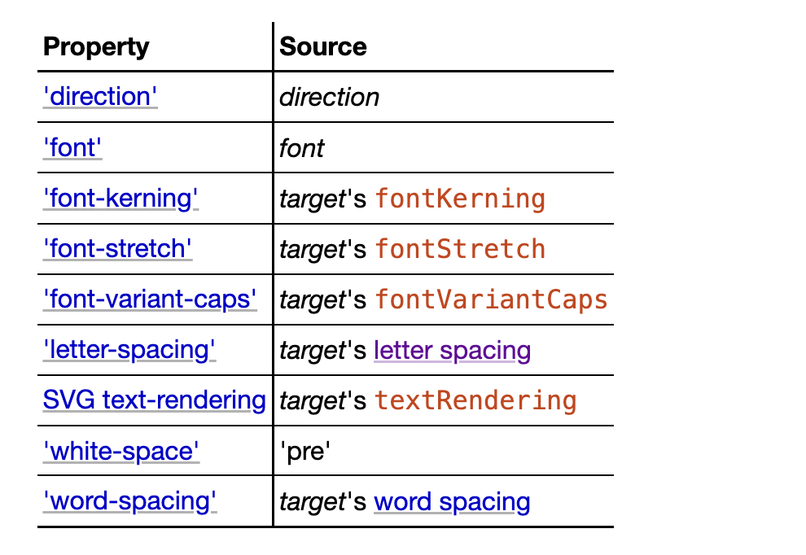
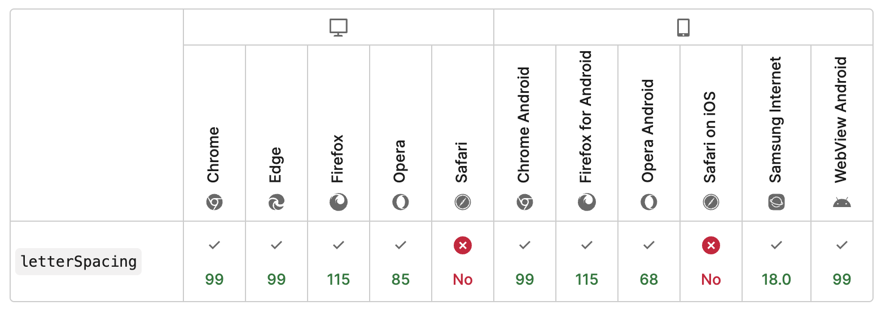

# measureText
## 有什么作用
不同于 DOM 方便的文字排版，在 Canvas 中想要实现文本换行、溢出隐藏/截断等功能，[`measureText`](https://developer.mozilla.org/zh-CN/docs/Web/API/CanvasRenderingContext2D/measureText) 是注定绕不开的 api

根据 HTML 标准描述：
>The measureText(text) method steps are to run the text preparation algorithm, passing it text and the object implementing the CanvasText interface, and then using the returned inline box must return a new TextMetrics object with members behaving as described in the following list:
https://html.spec.whatwg.org/multipage/canvas.html#dom-context-2d-measuretext

与 `fillText` 、 `strokeText` 类似，都会经历文本准备算法的排版，得到每个文字的矩形信息、物理对齐方式 (physical alignment) 与行内框 (inline box)
同时 `measureText` 会返回一个 [TextMetrics](https://developer.mozilla.org/zh-CN/docs/Web/API/TextMetrics) 对象
> The text preparation algorithm is as follows. It takes as input a string text, a CanvasTextDrawingStyles object target, and an optional length maxWidth. It returns an array of glyph shapes, each positioned on a common coordinate space, a physical alignment whose value is one of left, right, and center, and an inline box. (Most callers of this algorithm ignore the physical alignment and the inline box.)
https://html.spec.whatwg.org/multipage/canvas.html#text-preparation-algorithm



常规的用法如下：

```js
const ctx = canvas.getContext('2d');
ctx.font = '20px PingFang SC';
const metrics = ctx.measureText('Hello World');
console.log(metrics.width);
```
 `metrics.width` 作为一段文本的实际宽度将参与后续的换行、溢出等功能实现

但对于换行功能文章不会过多描述，网络上能搜到很多优秀的实现，相关原理也可以找到，这里贴一个张老师的博客链接 [canvas文本绘制自动换行、字间距、竖排等实现](https://www.zhangxinxu.com/wordpress/2018/02/canvas-text-break-line-letter-spacing-vertical/)

## letter-spacing
文章着重想介绍的是 [`letter-spacing`](https://developer.mozilla.org/en-US/docs/Web/CSS/letter-spacing)
这个属性的在 CSS 中是设置文字间距的，但在 Canvas 中使用时，它的表现值得我们注意
首先，我们想在 `measureText` 时，设置文字间距应该怎么做？

```js
const ctx = canvas.getContext('2d');
ctx.letterSpacing = '10px';
const metrics = ctx.measureText('Hello World');
```
语法上没有问题，但是很遗憾， **Safari 不支持**

那能表示在 FireFox、Chrome 等浏览器中，`letterSpacing` 能符合预期的工作了吗？
不全是，**Chrome 实现了一个非标准声明的功能，`ctx.letterSpacing` 未显式定义时，会继承 `canvas.style.letterSpacing`**

相关参考链接：
>https://github.com/CreateJS/EaselJS/issues/872
https://stackoverflow.com/questions/8952909/letter-spacing-in-canvas-element/8955835#8955835
https://jsfiddle.net/hg4pbsne/1/

```html
<style>canvas {letter-spacing: 0.1em}</style>
<canvas id="canvas"></canvas>
<script>
  const canvas = document.getElementById('canvas');
  const ctx = canvas.getContext('2d');
  ctx.font = '20px PingFang SC';
  console.log(ctx.letterSpacing); // 0px
  const metrics = ctx.measureText('一段文本');
  console.log(metrics.width); // 88px
</script>
```
这个场景下，Chrome 中 `ctx.letterSpacing` 打印是 0px，`canvas.style.letterSpacing` 是 `0.1em`，最终 `metrics.width` 测得 88px，**而 FireFox 中是 80px**

**项目中遇到测量的宽度不符合预期时，记得检查一下 canvas 标签的样式**

如果在意两边的浏览器表现一致，可以简单处理
```js
ctx.letterSpacing = getComputedStyle(canvas).letterSpacing;
```
如果想完全屏蔽样式的影响，也可以使用 [OffscreenCanvas](https://developer.mozilla.org/zh-CN/docs/Web/API/OffscreenCanvas) 来进行文本测量，它的兼容性已经非常不错了

只是浏览器实现差异，我们还能接受，但是 Chrome 上的这点就得小心了

WIP